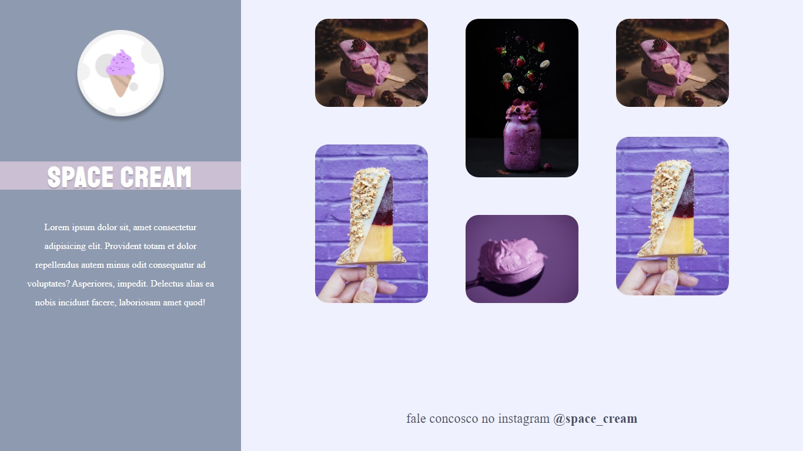

# Desafio Grid com Animações

Desafio do Stage03 que faz parte do Programa Explorer da Rocketseat  

A ideia agora é criar o Space Cream na versão Desktop! 🚀  

Se atente ao conteúdo que foi passado na aula. Portanto, **nesse** desafio, lembre-se de usar:  

- Grid;
- Animações e transições, como visto em aula;
- Media queries.

## Screenshots

[🔗 Clique aqui para acessar o Projeto](https://fabiovascao.github.io/Projeto-04-Grid-Com-Animacoes/)  
[🔗 Clique aqui para acessar o Figma](https://www.figma.com/file/Pe7uutrNAEaUnub53wSKHU/Stage-03-Grid-com-anima%C3%A7%C3%B5es-Copy?fuid=1151137169943796805)

## 🛠 Tecnologias

- HTML
- CSS
- Git e Github

## Autor

- [@FabioVascão](https://www.github.com/fabiovascao)